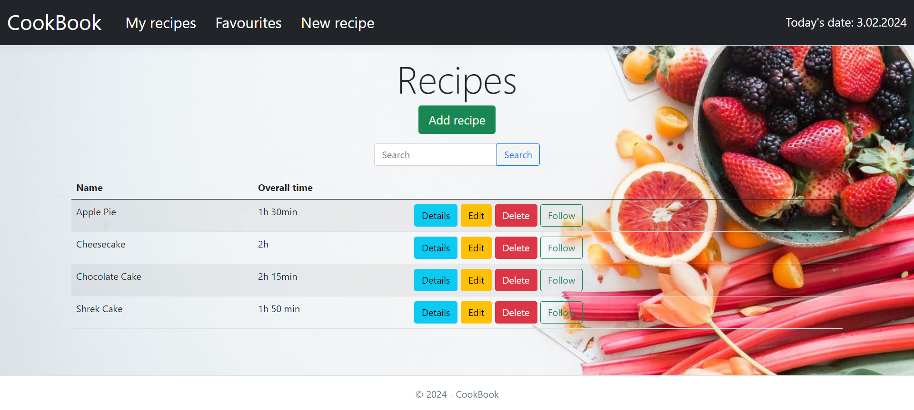
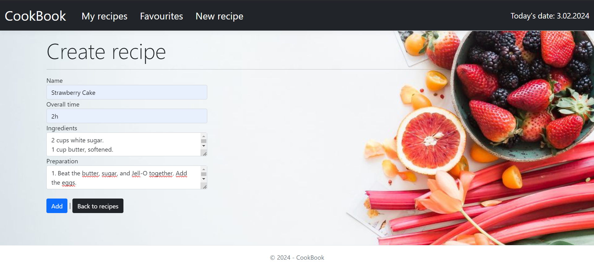
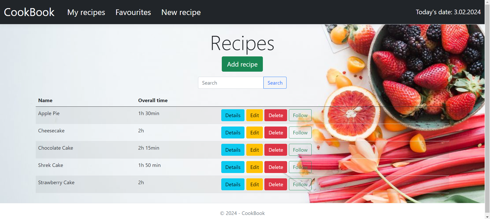
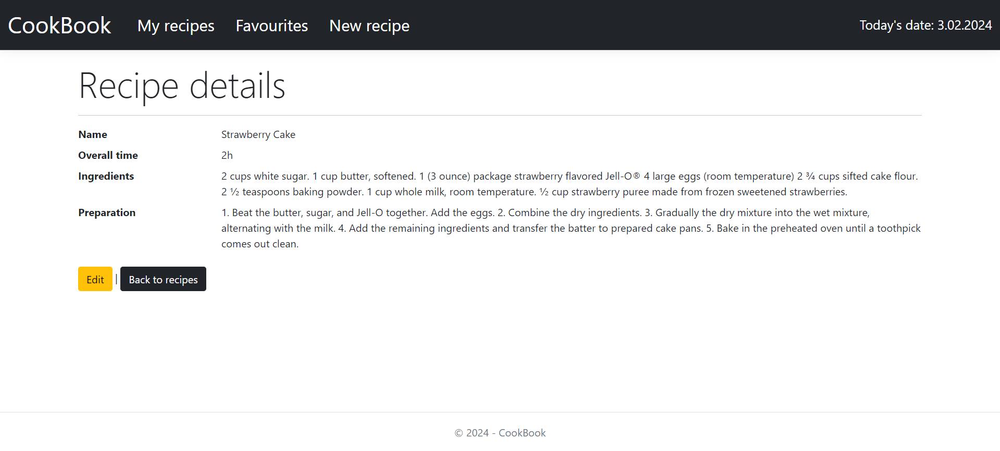
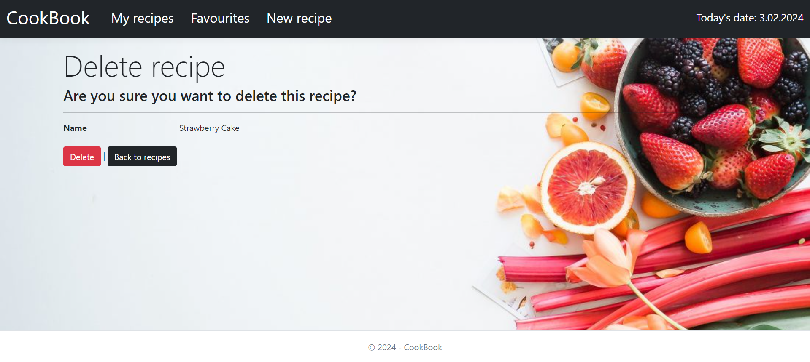
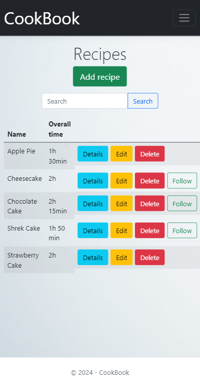
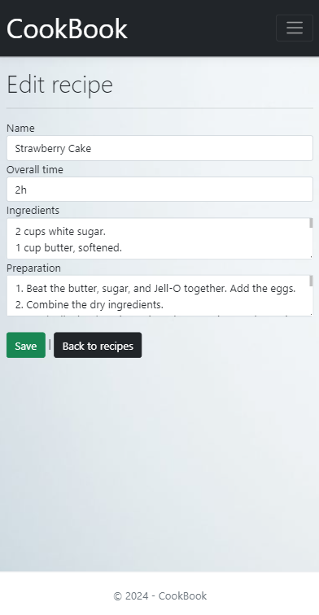

# CookBook

## About project
CookBook is a web application that enables effective management of culinary recipes. The application aims to make it easier to store and organize recipes in a database and to allow adding new recipes. Thanks to graphical interface, the application is very easy to use, allowing users to quickly find, edit and add recipes to their collection. All repository methods were tested in the project by xUnit. 

## Construction and communication of application
- Application type: **web application**
- Architecture: **monolithic (MVC)**
- Communication: **HTTP request/response**

## Technologies
- **ASP.NET Core (MVC)**
- **C#**
  - asynchronous programming (async/await)
  - MVC, Dependency Injection, DTO, Repository patterns
  - LINQ queries
  - mapping profiles
  - configuration management with file *appsettings.json*
- Database: **Microsoft SQL Server**
- ORM: **Entity Framework Core**
  - Migrations
- Unit testing: **xUnit**
- **HTML**
- **CSS**
- **JavaScript**
- **Bootstrap components**

## Features of the project
Adding and following a new recipe, editing, deleting, listing recipes, displaying recipes. Recipes are added to the MSSQL database. The current date is displayed in the navigation bar at the top.

## Images
Home page:

Recipes page:

Creating a new recipe:

Recipes after adding new one:

Recipe details page:

Editing recipe details:

Deleting recipe:

Favourite recipes after following:

Searched recipes:

Application in mobile version:  

Unit testing with xUnit:

